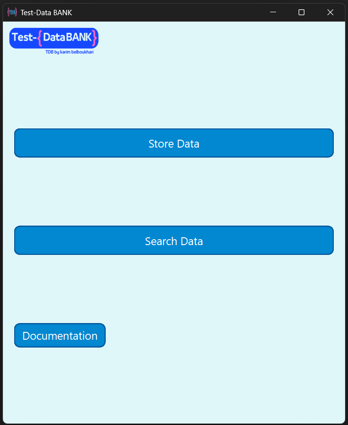

# 🏦 TestDataBank Desktop App v1.0 - Initial Release 🚀 by karim 

TestDataBank is a robust tool designed to help QA testers organize, manage, and store test data effectively. With features like data export, MySQL integration, and seamless installation checks, TestDataBank is the perfect companion for efficient test data management.

---

## 🎉 Key Features

- **Data Storage & Organization**: Store key test details such as username, password, tags, comments, and environment configurations.
- **Export Options**: Export search results in Excel, PDF, or JSON formats, making it easy to share and report findings.
- **MySQL Database Integration**: Built-in MySQL database setup for reliable, structured data storage.
- **Automatic Python Check**: Detects or installs Python as needed for smooth application execution.

---

## 📥 Installation Guide

### Prerequisites
- **Windows OS** 💻

### Steps
1. Download the installer from the [release page](https://github.com/karim-belboukhari/TestDataBank_By_Karim/releases/tag/v0.1.0).
2. Run the installer and follow the on-screen instructions.
   - MySQL will be installed if not already present.
   - Python will be installed if not detected in the system.
3. Launch **TestDataBank** via the desktop shortcut created during installation.

> **Note**: Ensure you have an active internet connection for smooth installation of dependencies.

---

## 🛠️ Usage Instructions

### 1. **Main Page**

The **Main Page** allows you to choose between two options:
- **Store Data**: Input new test data into the system.
- **Search Data**: Find and export existing test data.

 

### 2. **Store Data Page**

In the **Store Data** page, you can enter new test data including usernames, passwords, tags, comments, and environment configurations.

 

### 3. **Search Data & Export Page**

On the **Search Data** page, search for test data using various filters and export the results in Excel, PDF, or JSON format for documentation or sharing purposes.

---

## 📝 Known Issues
- No major issues reported in this initial release. Please [report issues](https://github.com/karim-belboukhari/TestDataBank_By_Karim/issues) or request features if you encounter any challenges.

---

## 💡 Future Roadmap

- **UI Enhancements**: More customizable and dynamic UI features.
- **Extended Database Support**: Future versions may support additional database options.
- **Platform Support**: Linux and macOS compatibility planned in future releases.

---

## 🙌 Contributing

Contributions are welcome! Feel free to submit a pull request or open an issue to suggest improvements or report bugs.

1. Fork the repository.
2. Create a new branch (`feature/new-feature`).
3. Commit changes to your branch.
4. Open a pull request.

---

## 📬 Contact

For questions, support, or collaboration ideas, feel free to reach out on [GitHub](https://github.com/karim-belboukhari).

---

Enjoy using **TestDataBank** to streamline your QA test data management!
